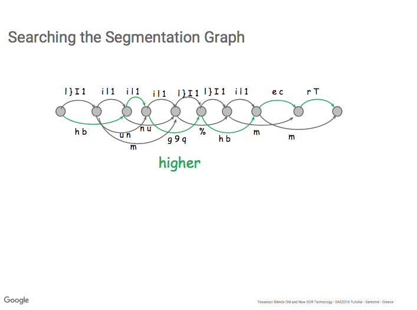
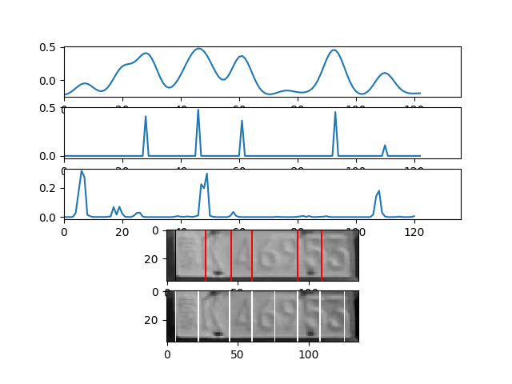
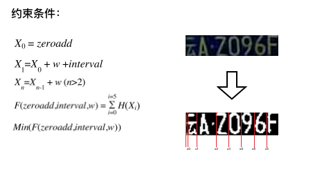
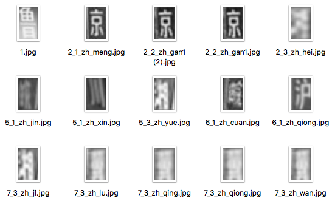

# HyperLPR字符分割

### 内容主要介绍

+ 字符分割


+ HyperLPR中的字符分割方法
+ 字符分割模型的训练
+ 转换到Caffemodel模型[待续]

#### 字符分割

字符分割是OCR中非常重要的部分。在讲字符分割之前，我给大家简要介绍一下传统OCR所采用的Pipline(当然现在目前大多数据商用的文档OCR解决方案也基本都是基于这种方法)。

+ 文档分析(提取文档区域，包括了文档的校正等操作)
+ 行分割
+ 字符分割
+ 字符识别
+ 重新排版

上列的每一条pipline几乎都决定了OCR系统最后的输出质量。其中字符切割也是OCR中非常重要的组成部分，也是决定OCR系统好坏的比较重要决定因素。

这里我和大家主要介绍几种字符分割方法:

1.基于联通域

基于联通域的分割方法较为简单，影响其效果的主要在在于二值化算法上。本文不再做过多概述，但这种方法在处理非联通字符的过程中往往不能达到良好的效果，所以在应用的过程中往往要结合分类器,概率链等手段来提高效果。

2.基于投影直方图

投影直方图是一种很重要的方法，他的思想是去找投影直方图上的极小值点作为分割点，都是在复杂场景的OCR过程中例如手写字符中不是特别理想。

3.基于滑动窗口

这里介绍一篇较为经典的论文([End-to-end text recognition with convolutional neural networks](http://ieeexplore.ieee.org/document/6460871/))在Cousera上Andrew Ng的Machine Learning课程中也提到了这种方法。在OpenCV的text模块中也有对应的实现。

它的主要思想是利用一个训练好的正负样本分类器来进行在图像上滑动然后产生概率response图，然后对raw response进行nms(非极大值移植)。在确定字符bdbox,数目之后使用类似于viterbi算法来获取最佳分割路径。


4.基于过分割

很多商业的OCR系统中采用此方法来进行字符分割，其主要的思想类似于object detection中的 region proposal. 先通过投影直方图等方法产生一系列候选的分割点，然后字符使用分类器对车型候选的分割点的不同组合进行分类，产生分割图。最后使用beamsearch,动态规划等方法找到图中的最佳分割路径。在Tesseract中也使用了这种方法来分割字符。





### HyperLPR中的字符分割方法

HyperLPR中使用的字符分割方法很简单.同样也是基于滑动窗口的分割方法。首先我们训练一个分类器输出三种概率分别为正样本、负样本、中文字符。

接着我们对车牌做滑动输出每个位置的三种字符概率（这个滑动的窗口的stride可以设高一点使得速度更快）接着我们对这三种利用车牌的模板进行匹配。使得第一个字符的中文概率+后6个字符的正样本概率最大。这个最大的位置即为最佳分割位置。



### 字符分割模型的训练

训练只需提供三种样本

在config.txt定义三种样本的目录

```python
../character_judgement_samples/T #正样本
../character_judgement_samples/F #负样本
../character_judgement_samples/CH #中文样本
```

#### 下面提供了三种样本的图例


##### 负样本


##### 中文样本



##### 正样本


#### 开始训练

`python training_segmentation.py`

##### 注意事项:

需要的依赖 

+ Tensorflow
+ Keras
+ OpenCV3

##### 使用

将模型移动至model目录下替换char_judgement.h5

#### 捐赠和支持我们:

**[支付宝/微信](http://chuantu.biz/t6/178/1513525003x-1404758184.png)**

#### 获取帮助

+ HyperLPR讨论QQ群：673071218, 加前请备注HyperLPR交流。